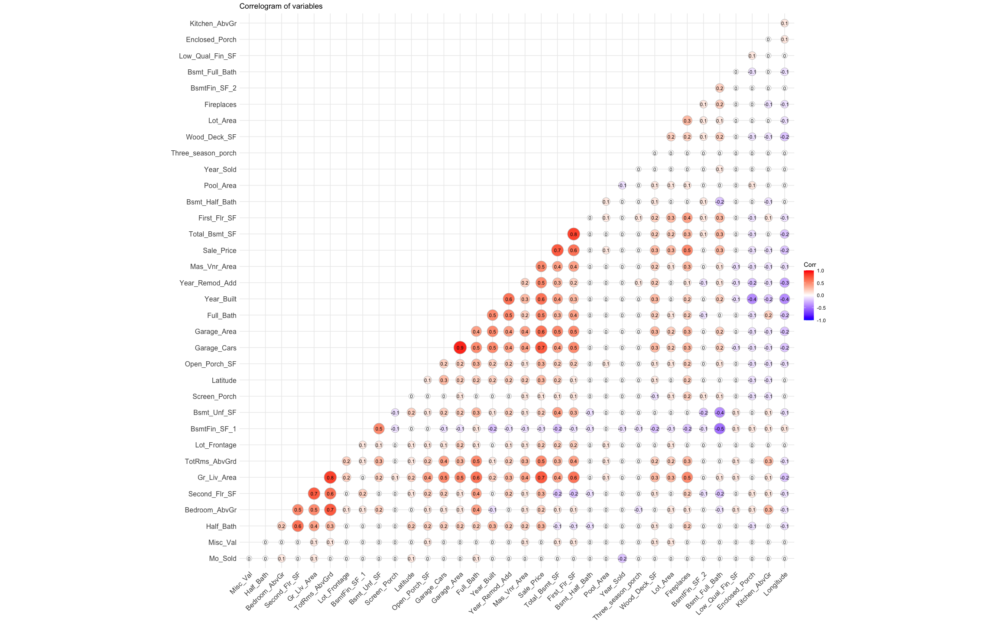
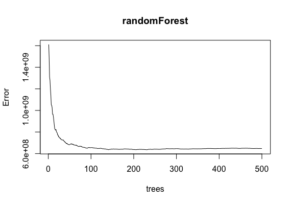
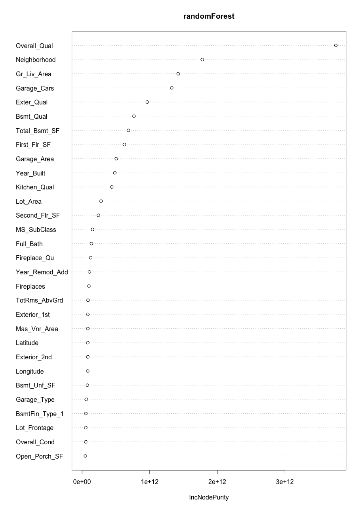
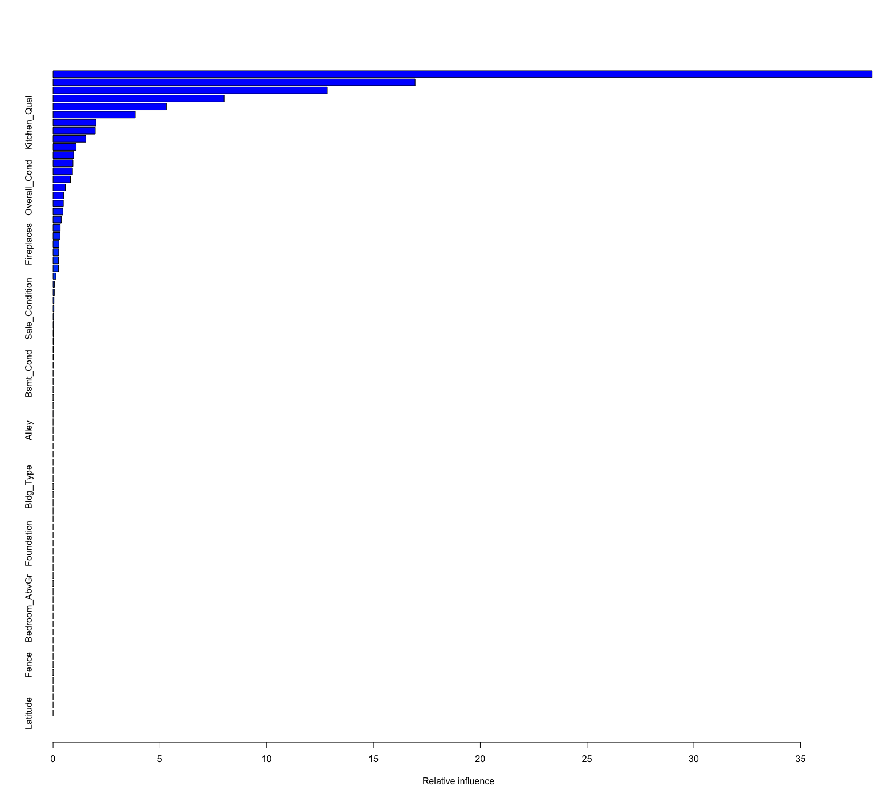

# Classification tree analysis

1. [Description of data](#1-description-of-data)
2. [Description of the problem](#2-description-of-the-problem)
3. [Description of the techniques](#3-description-of-the-techniques)
4. [Descriptions of results](#4-descriptions-of-results)

## 1. Description of data 

In this assignment a dataset from the package 'AmesHousing' (version 0.0.4) was used. The dataset is called The Ames Iowa Housing Data. The data described by De Cock (2011) where 81 fields were recorded for 2,930 properties in Ames IA. There 35 numerical variables and 46 categorical.

The **columns** include: Order, PID, MS SubClass, MS Zoning, Lot Frontage, Lot Area, Street, Yr Sold, Sale Type, Sale Condition and others.   

First of all, I started with data exploration. I checked if there are any missing values in the dataset. After this step, I confirmed that there are no NA values, and the dataset is complete. 

Next, let's explore relationship between numerical variables. For this correlation matrix was created. It is a technique to identify multicollinearity among numerical variables. It can also be visualized on the plot:

So, the output above shows a strong linear correlation between the variables First_Flr_SF and Total_Bsmt_SF (0.8), Garage_Area and Garage_Cars (0.9). Also, a strong correlation is between Gr_Liv_Area and TotRms_AbGrd (0.8).

## 2. Description of the problem 

This assignment aims to use regression tree analysis to predict the sale price for houses. Next, compare results of using Bagging, Random Forest and Boosting algorithms on housing data. Lastly, find the top important variables for this data. 

## 3. Description of the techniques 

Then data was divided into two subsets, where one part was training data, and another one is test data. In this example, it 80 and 20 percent respectively. Training data was used to train my model, and test data was used to test the results and to predict values.

**Bagging.** Bootstrap aggregating or bagging is a machine learning ensemble algorithm designed to improve statistical classification and regression accuracy. 
First of all, it generates $N$ number of bootstrap samples set. $\hat{f^n}(x)$ is the regression tree trained on the $n$th bootstrap esamble. Then averaging gives: 
$$ \hat{f}_{bag}(x) = \frac{1}{N} \sum^N_{m=1} \hat{f^n}(x) $$

**Random Forest.** The random forest consists of a large number of individual decision trees that operate as an ensemble.  For each tree, at each split will be taken a random sample of predictors. So, The Random Forest algorithm:

1) Forms several bags (using bootstrapping)
2) For each bag builds a tree
3) For each node in the tree chooses a random set of features
4) Merges predictions using majority vote or averaging

**Boosting.** Boosting is an ensemble method for improving the model predictions. The idea of boosting is to train weak learners sequentially, each trying to correct its predecessor. They are two main types of boosting: AdaBoost (Adaptive Boosting) and Gradient Boosting.

*Adaboost* combines multiple weak learners into a single strong learner. The weak learners in AdaBoost are decision trees with a single split, called decision stumps. When AdaBoost creates its first decision stump, all observations are weighted equally. To correct the previous error, the observations that were incorrectly classified now carry more weight than the observations that were correctly classified.

*Gradient Boosting* works by sequentially adding predictors to an ensemble, each one correcting its predecessor. However, instead of changing the weights for every incorrect classified observation at every iteration, Gradient Boosting method tries to fit the new predictor to the residual errors made by the previous predictor.

## 4. Descriptions of results 

In this part, we will go through every algorithm and compare its performance. I have a pre-trained model and predicted values for the test data. Then I compared the predicted value with the actual values in the test data and analyze the accuracy of the model.

In the **bagging model**, root mean squared error is **33467.84** By default bagging algorithm performs 25 bootstrap samples. I tried to play around with this number and increase it to 30, 40 and 50. But it didn't significantly improve performance, so I left with a default number of samples. 

In the **random forest model**, root mean squared error is **22058.3**. Comparing to bagging, our new model reduced RMSE by about $10 000. 

Below plot of error rate is presented. It shows that error rate stabilizes with around 100 trees but still increase until around 200

Also, let's take a look of variable importance. The variables with the highest importance scores are the ones that give the best prediction and contribute most to the model.

In the **boosting model** the shrinkage parameter lambda controls the rate at which boosting learns (usually between 0.01 and 0.001), and the smaller value implies a slow learning rate. Unlike random forests and bagging, boosting can overfit if the number of trees is very large.

So, the root mean squared error with parameter lambda is equal to 0.01 is **24198.48**. And if lambda is equal to 0.001 root mean squared error will be **24358.67**. Summary plot of boosting model is

## 5. Conclusions 

So, in this assignment Bagging, Random Forest and Boosting algorithms were used to predict houses' sale price.  In my case, the best estimation for this task was given by the Random Forest model, where RMSE was 22058.3. Then a little bit less accurate was boosting model, with the RMSE equal to 24198.48. And the last one was the bagging model with the root mean squared error is 33467.84.

Also, regarding the top important variables for this data, the top 5 variables are: Overall_Qual, Neighbourhood, Gr_Liv_Area, Garage_Cars, Exter_Qual. 

If we look at the relative influence, the top variance in boosting are Kitchen_Qual, Overall_Cond and Fireplaces.

